# 算法过程可视化系统 — 系统设计文档

---

## 文档信息

| 项目 | 内容 |
|------|------|
| 项目名称 | 算法过程可视化系统（AVS） |
| 文档版本 | V1.0 |
| 编写日期 | 2026-06-19 |
| 文档类型 | 系统设计文档 |
| 对应文档 | 《项目任务书》《需求分析文档 V1.0》 |
| 技术路线 | Vue 3 + Vite + JavaScript，Canvas / SVG，Vue Router Hash 模式 |

### 版本修订记录

| 版本 | 日期 | 修订说明 |
|------|------|----------|
| V1.0 | 2026-06-19 | 初稿：总体设计、详细设计、UML 图、AI 辅助说明 |

---

## 目录

1. [引言](#1-引言)
2. [总体设计](#2-总体设计)
3. [详细设计](#3-详细设计)
4. [界面与交互设计](#4-界面与交互设计)
5. [需求追踪与设计映射](#5-需求追踪与设计映射)
6. [AI 辅助系统设计说明](#6-ai-辅助系统设计说明)

---

## 1. 引言

### 1.1 编写目的

本文档在《需求分析文档》基础上，说明算法过程可视化系统（AVS）如何从需求转化为可实现的软件结构。文档面向项目组成员与指导教师，作为编码实现、联调测试及最终项目文档中「系统设计」章节的依据。

### 1.2 设计原则

| 原则 | 说明 |
|------|------|
| **需求驱动** | 每项设计元素可追溯到 FR/NFR 或验收标准 AC-xx |
| **算法与 UI 分离** | 算法步骤生成独立于 Vue 组件与 Canvas/SVG 渲染 |
| **统一接口** | 三类算法均通过 `generateSteps(input)` 输出统一步骤序列 |
| **可扩展** | 新增第 4 类算法仅需实现算法模块 + 可视化组件 + 路由页面 |
| **纯前端部署** | 无后端依赖，支持 `npm run build` 静态托管 |

### 1.3 需求摘要（设计输入）

本期实现 **快速排序**、**Dijkstra 最短路径**、**汉诺塔** 三类算法的过程可视化；满足统一入口、手动/随机输入、过程展示、复杂度说明、≥6 条测试用例等基本功能。扩展功能（播放控制、回退、日志导出、输入校验）按优先级在基本框架就绪后迭代接入。

---

## 2. 总体设计

### 2.1 系统架构

系统采用 **浏览器端单页应用（SPA）** 架构，分为表现层、业务逻辑层与数据层三层结构。

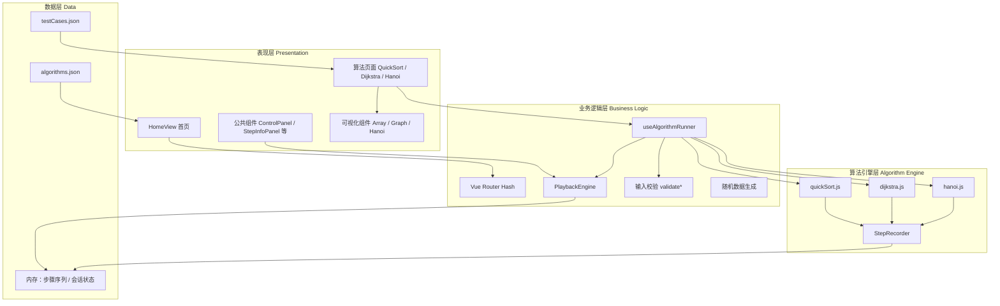

**架构说明：**

- **表现层**：负责路由页面、统一布局与算法专属可视化渲染。
- **业务逻辑层**：封装播放控制、输入校验、用例加载等与具体算法无关的流程。
- **算法引擎层**：纯 JavaScript 实现，每步通过 `StepRecorder` 记录状态快照与说明文字。
- **数据层**：静态 JSON 配置 + 运行时内存状态，基本版不落库。

### 2.2 系统结构设计（模块划分）

| 模块编号 | 模块名称 | 职责 | 对应需求 |
|----------|----------|------|----------|
| M1 | 路由与导航模块 | Hash 路由、首页入口、顶栏导航 | FR-001 |
| M2 | 算法元数据模块 | 算法列表、简介、复杂度展示 | FR-001, FR-007 |
| M3 | 数据输入模块 | 手动输入、随机生成、格式解析 | FR-002, FR-003 |
| M4 | 输入校验模块 | 格式与范围检查、错误提示 | FR-009 |
| M5 | 测试用例模块 | 加载预设用例、对照期望结果 | FR-008 |
| M6 | 算法执行引擎 | `generateSteps`、步骤序列生成 | FR-004 |
| M7 | 步骤记录器 | 统一步骤对象结构与 record API | FR-004, FR-005 |
| M8 | 播放控制模块 | 单步/自动/暂停/重置/回退（扩展） | FR-010, FR-011 |
| M9 | 可视化渲染模块 | Canvas/SVG 按步骤快照绘图 | FR-004 |
| M10 | 信息展示模块 | 步骤说明、最终结果、复杂度 | FR-005, FR-006, FR-007 |
| M11 | 日志导出模块（扩展） | 步骤序列导出为文本 | FR-012 |

### 2.3 包图（目录结构）

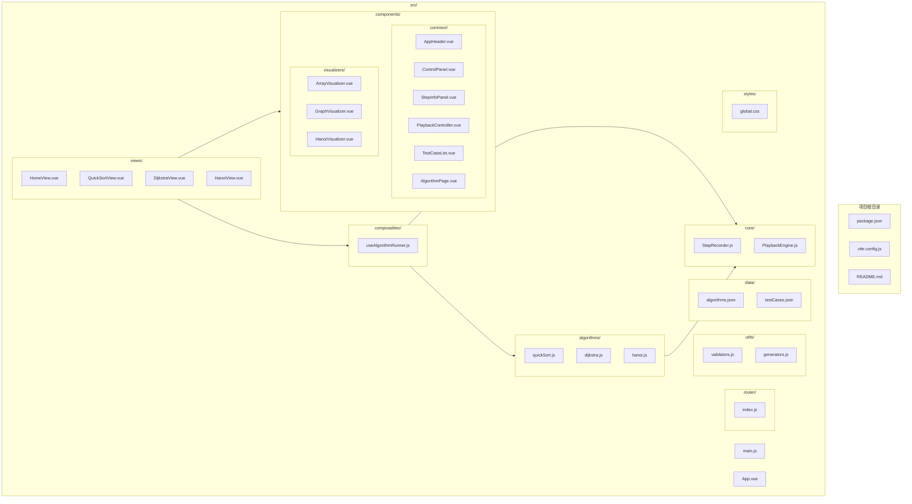

### 2.4 部署结构

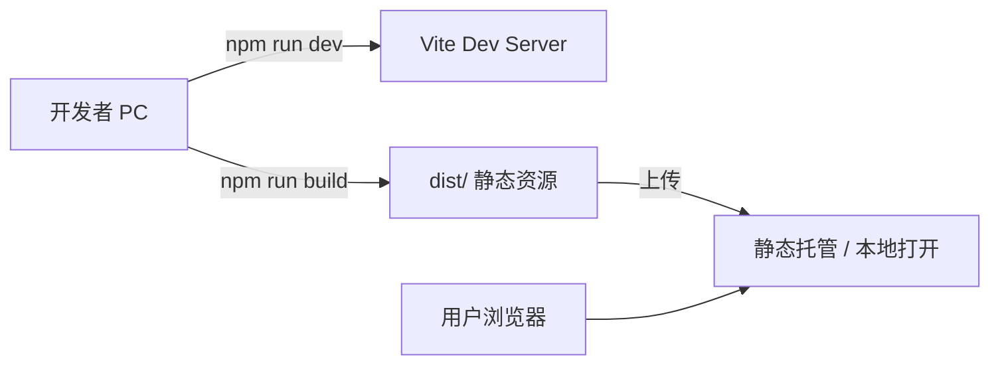

- 路由模式：**Hash**（`#/quick-sort`），避免静态服务器 rewrite 配置。
- 构建产物：`dist/` 目录，含 `index.html` 与打包后的 JS/CSS。

---

## 3. 详细设计

### 3.1 数据结构设计

#### 3.1.1 算法元数据（algorithms.json）

```json
{
  "id": "quick-sort",
  "name": "快速排序",
  "category": "排序",
  "difficulty": "低-中",
  "timeComplexity": "O(n log n) 平均 / O(n²) 最坏",
  "spaceComplexity": "O(log n)",
  "description": "选取基准元素，分区后递归排序子区间。",
  "route": "/quick-sort"
}
```

| 字段 | 类型 | 说明 |
|------|------|------|
| id | string | 算法唯一标识，与 testCases 关联 |
| name | string | 显示名称 |
| category | string | 排序 / 图算法 / 递归 |
| difficulty | string | 难度标注 |
| timeComplexity | string | 时间复杂度说明 |
| spaceComplexity | string | 空间复杂度说明 |
| description | string | 算法简介 |
| route | string | 路由路径 |

#### 3.1.2 测试用例（testCases.json）

```json
{
  "id": "TC-S-01",
  "algorithmId": "quick-sort",
  "name": "普通无序数组",
  "description": "验证基本分区与排序正确性",
  "input": { "array": [64, 34, 25, 12, 22, 11, 90] },
  "expected": { "sorted": [11, 12, 22, 25, 34, 64, 90] }
}
```

| 字段 | 类型 | 说明 |
|------|------|------|
| id | string | 用例编号 TC-S-01 等 |
| algorithmId | string | 所属算法 |
| name | string | 用例名称 |
| description | string | 用例说明 |
| input | object | 算法专属输入结构 |
| expected | object | 期望输出要点（用于结果对照） |

**各算法 input 结构：**

| 算法 | input 字段 | 说明 |
|------|------------|------|
| 快速排序 | `array: number[]` | 待排序整数数组 |
| Dijkstra | `nodes, edges, source, target, directed?` | 节点数、边列表、源点、目标点 |
| 汉诺塔 | `disks: number` | 盘子数量 n（3~8） |

#### 3.1.3 统一步骤对象（ExecutionStep）

所有算法 `generateSteps` 返回 `ExecutionStep[]`：

```typescript
// 逻辑类型说明（实现为 JavaScript 对象）
interface ExecutionStep {
  index: number;           // 步骤序号，从 0 开始
  type: string;            // 步骤类型，如 compare / swap / visit / move
  description: string;     // 中文步骤说明（FR-005）
  state: StepState;        // 该步完整可视化状态快照
  highlight?: object;      // 可选：当前高亮元素索引等
}

interface StepState {
  // 快排
  array?: number[];
  pivotIndex?: number;
  left?: number;
  right?: number;
  comparing?: [number, number];
  // Dijkstra
  graph?: { nodes: number; edges: Edge[]; directed?: boolean };
  distances?: number[];
  visited?: number[];
  currentNode?: number;
  predecessors?: number[];
  // 汉诺塔
  towers?: number[][];     // 三根柱，每柱为盘子直径栈
  move?: { from: number; to: number; disk: number };
}
```

#### 3.1.4 执行会话（ExecutionSession，内存）

| 字段 | 类型 | 说明 |
|------|------|------|
| algorithmId | string | 当前算法 |
| input | object | 解析后的合法输入 |
| inputSource | enum | manual / random / testcase |
| steps | ExecutionStep[] | 完整步骤序列 |
| currentStepIndex | number | 当前展示步骤索引 |
| status | enum | idle / ready / playing / paused / completed |
| finalResult | object | 算法最终结果 |
| testCaseId | string? | 若来自用例则记录 |

#### 3.1.5 图算法边结构（Edge）

```json
{ "from": 0, "to": 1, "weight": 4 }
```

无向图在引擎内部可双向松弛；`directed: true` 时仅按 from→to 松弛。

### 3.2 核心类设计（类图）

系统以 JavaScript 模块 + Vue Composable 实现，下图描述逻辑类及依赖关系。

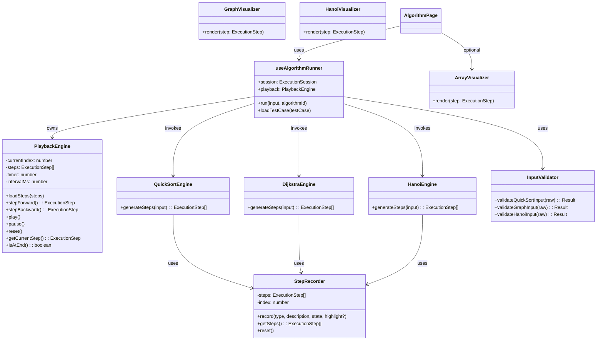

### 3.3 接口设计

#### 3.3.1 算法引擎统一接口

```javascript
/**
 * 所有算法模块必须导出的主函数
 * @param {object} input - 经校验的结构化输入
 * @returns {ExecutionStep[]} 完整步骤序列（含初始态与终态）
 */
export function generateSteps(input) { ... }
```

| 模块 | 文件 | 输入 | 输出 finalResult |
|------|------|------|------------------|
| 快速排序 | `algorithms/quickSort.js` | `{ array }` | `{ sorted, swapCount? }` |
| Dijkstra | `algorithms/dijkstra.js` | `{ nodes, edges, source, target, directed? }` | `{ distances, path, reachable }` |
| 汉诺塔 | `algorithms/hanoi.js` | `{ disks }` | `{ totalMoves, moves[] }` |

#### 3.3.2 StepRecorder 接口

```javascript
class StepRecorder {
  record(type, description, state, highlight = null)
  getSteps()
  reset()
}
```

- 算法实现中每发生关键状态变化调用 `record`，**禁止**在 Vue 组件内直接修改算法状态。

#### 3.3.3 PlaybackEngine 接口

| 方法 | 说明 | 触发 UI 更新 |
|------|------|--------------|
| `loadSteps(steps)` | 加载步骤并重置索引 | 展示第 0 步或初始步 |
| `stepForward()` | 前进一步 | 更新可视化与说明 |
| `stepBackward()` | 回退一步（扩展 FR-011） | 同上 |
| `play()` | 按 interval 自动前进 | 循环至末步或暂停 |
| `pause()` | 停止定时器 | 保持当前步 |
| `reset()` | 索引归零 | 回到初始状态 |
| `getCurrentStep()` | 返回当前 ExecutionStep | — |
| `exportLog()` | 拼接 description 文本（扩展 FR-012） | 下载 .txt |

#### 3.3.4 输入校验接口

```javascript
// utils/validators.js
function validateQuickSortInput(rawString) {
  return { valid: boolean, data?: { array }, error?: string }
}
function validateGraphInput(rawString) { ... }
function validateHanoiInput(rawString) { ... }
```

校验失败时 **不调用** `generateSteps`，由 ControlPanel 展示 `error` 文案。

#### 3.3.5 Vue 组件 Props / Events（公共组件）

**AlgorithmPage（算法页布局壳）**

| Props | 说明 |
|-------|------|
| algorithmId | 当前算法 ID |
| visualizerComponent | 可视化子组件 |

| Events | 说明 |
|--------|------|
| run | 用户触发执行 |
| load-case | 加载测试用例 |

**ControlPanel**

| Events | 说明 |
|--------|------|
| input-change | 手动输入变更 |
| random-generate | 随机生成 |
| run | 开始运行 |
| validate-error | 校验失败 |

**PlaybackController**

| Events | 说明 |
|--------|------|
| step-forward / step-backward | 单步控制 |
| play / pause / reset | 播放控制 |
| export-log | 导出日志（扩展） |

**TestCaseList**

| Props | cases（过滤当前 algorithmId） |
| Events | select-case（选中并填入输入区） |

#### 3.3.6 路由接口

| 路径 | 组件 | 说明 |
|------|------|------|
| `/` 或 `/#/` | HomeView | 统一入口，算法卡片列表 |
| `/#/quick-sort` | QuickSortView | 快速排序 |
| `/#/dijkstra` | DijkstraView | Dijkstra |
| `/#/hanoi` | HanoiView | 汉诺塔 |

### 3.4 各模块处理过程设计

#### 3.4.1 算法选择与导航（M1）

**处理流程：**

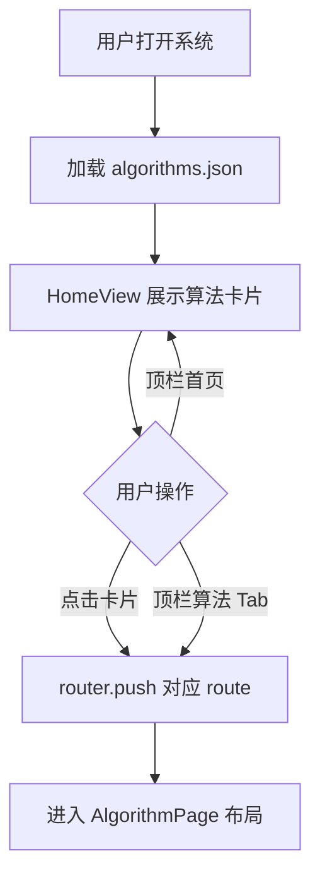

- AppHeader 提供系统标题、「首页」链接、算法切换入口。
- 算法页标题区提供「← 返回主页」按钮（与需求界面概要一致）。

#### 3.4.2 数据输入与校验（M3 + M4）

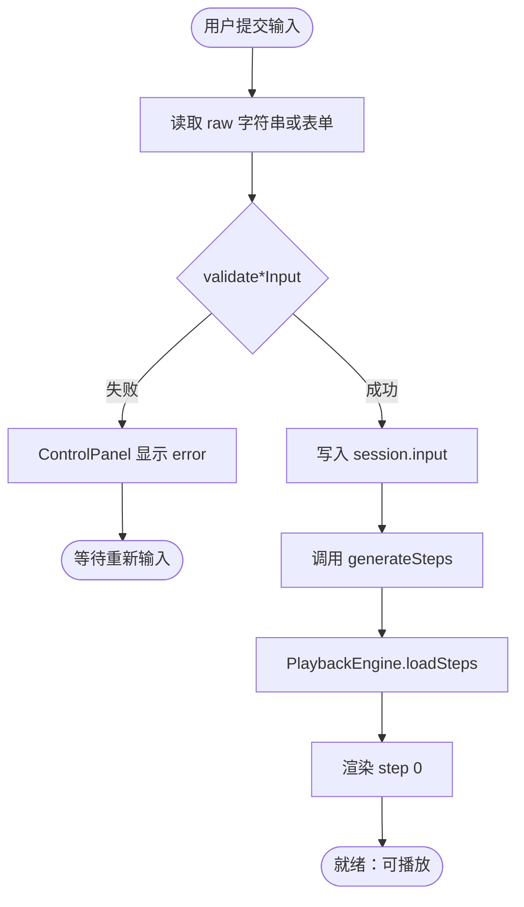

**快排输入格式：** 逗号或空格分隔整数，如 `64,34,25,12`；长度建议 2~20。

**图输入格式（示例）：** 节点数 n；边列表 `0-1:4, 1-2:2`；源点、目标点整数；可选 `directed`。

**汉诺塔输入：** 整数 n，范围 3~8。

#### 3.4.3 算法执行与步骤生成（M6 + M7）

**通用流程：**

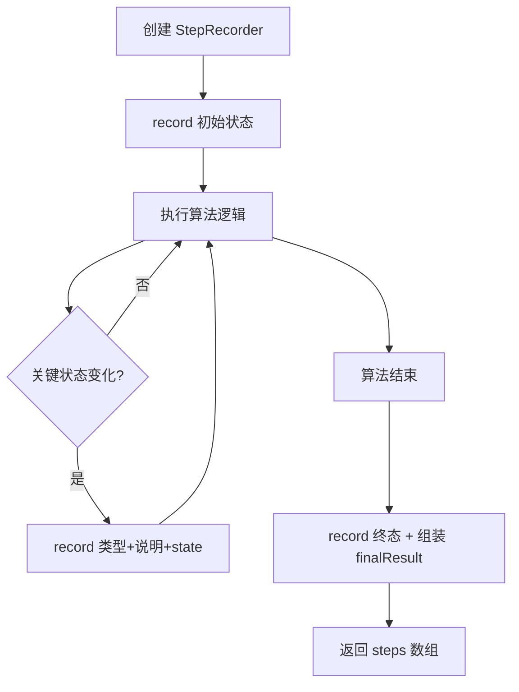

**快速排序关键步骤类型：**

| type | 触发时机 | state 要点 |
|------|----------|------------|
| init | 读入数组 | array |
| pick-pivot | 选定基准 | pivotIndex, left, right |
| compare | 比较两元素 | comparing, array |
| swap | 交换元素 | array |
| partition-done | 分区完成 | pivot 归位 |
| complete | 全数组有序 | sorted array |

**Dijkstra 关键步骤类型：**

| type | 触发时机 | state 要点 |
|------|----------|------------|
| init | 初始化距离表 | distances, visited=[] |
| select | 选取当前最小距离节点 | currentNode |
| relax | 松弛边 | distances, predecessors |
| complete | 算法结束 | 最终距离与路径 |

**汉诺塔关键步骤类型：**

| type | 触发时机 | state 要点 |
|------|----------|------------|
| init | 初始叠放 | towers |
| move | 每次合法移动 | towers, move{from,to,disk} |
| complete | 全部移到目标柱 | towers, totalMoves |

#### 3.4.4 播放控制（M8）

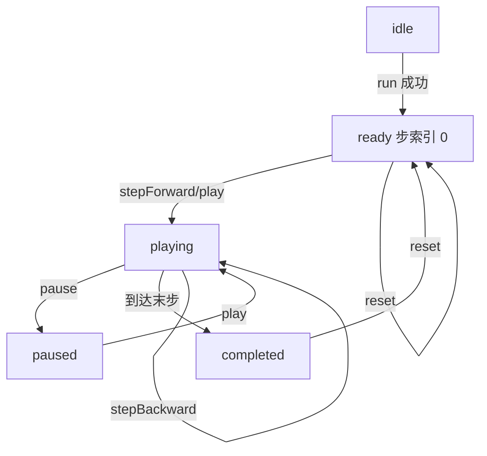

- `play()` 使用 `setInterval`，间隔默认 800ms（可配置，扩展）。
- `stepBackward` 索引减 1，不小于 0。
- Vue 侧通过 `ref(currentStepIndex)` 与 PlaybackEngine 同步，确保可视化响应式更新（避免仅改引擎内部索引不触发渲染）。

#### 3.4.5 可视化渲染（M9）

| 组件 | 技术 | 输入 | 绘制逻辑 |
|------|------|------|----------|
| ArrayVisualizer | Canvas | ExecutionStep.state | 柱状图高度映射数值；高亮 pivot、比较对、分区边界 |
| GraphVisualizer | SVG | ExecutionStep.state | 力导向或固定布局节点；边权标签；高亮 currentNode、松弛边 |
| HanoiVisualizer | Canvas | ExecutionStep.state | 三柱 + 圆盘堆叠；移动动画可随步进切换状态 |

渲染原则：**只读** `step.state`，不向算法引擎回写。

#### 3.4.6 测试用例加载（M5）

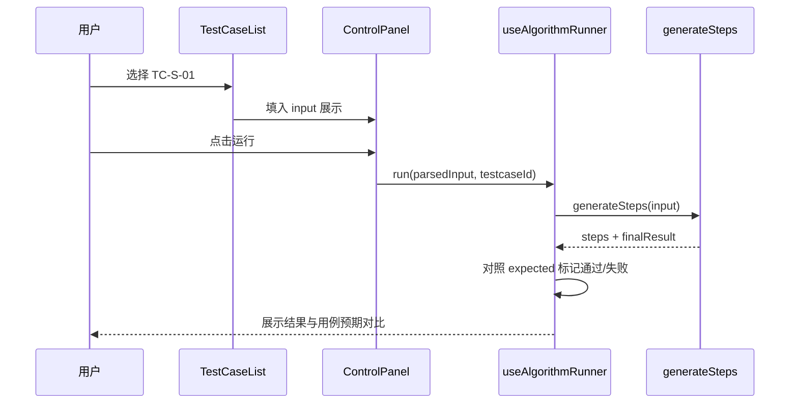

### 3.5 关键时序图

#### 3.5.1 用户执行一次完整可视化

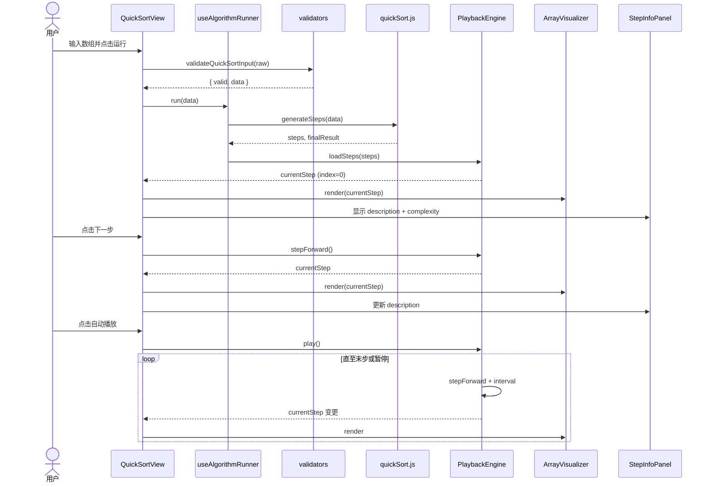

#### 3.5.2 随机生成测试数据

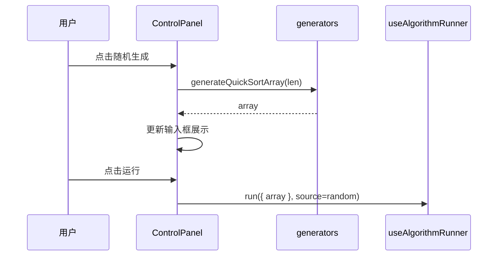

### 3.6 各算法详细流程图

#### 3.6.1 快速排序 generateSteps

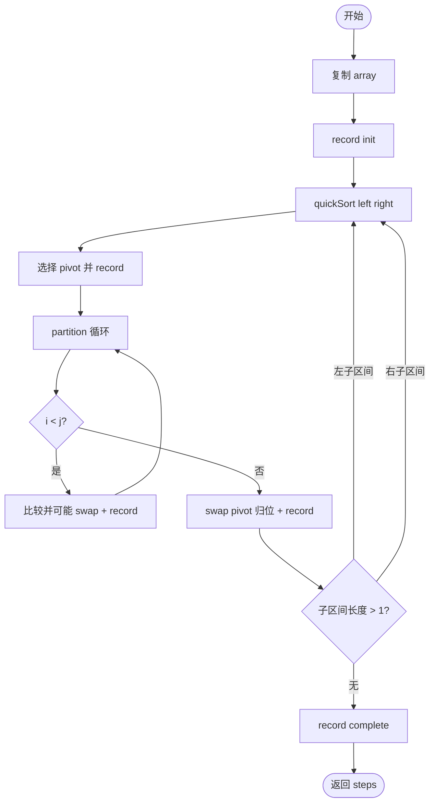

#### 3.6.2 Dijkstra generateSteps

```mermaid
flowchart TD
    S([开始]) --> Init[初始化 dist/pred/visited]
    Init --> R0[record init]
    R0 --> Loop{存在未访问节点?}
    Loop -->|否| Complete[record complete + 构建路径]
    Loop -->|是| Select[取 dist 最小未访问 u + record]
    Select --> Mark[标记 u 已访问]
    Mark --> Edges[遍历 u 的邻边]
    Edges --> Relax{dist[u]+w < dist[v]?}
    Relax -->|是| Update[更新 dist/pred + record relax]
    Relax -->|否| Edges
    Update --> Edges
    Edges --> Loop
    Complete --> E([返回 steps])
```

#### 3.6.3 汉诺塔 generateSteps

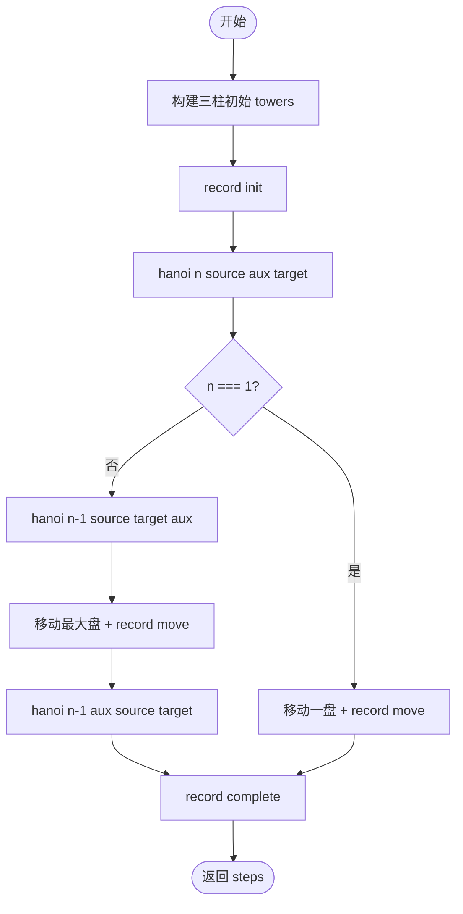

---

## 4. 界面与交互设计

### 4.1 页面布局（统一三栏结构）

所有算法页共用 `AlgorithmPage` 布局，保证 NFR-002 一致性。

```
┌─────────────────────────────────────────────────────────────┐
│ AppHeader：标题 | 首页 | 快排 | Dijkstra | 汉诺塔            │
├─────────────────────────────────────────────────────────────┤
│ [← 返回主页]  算法名称 + 简介                                │
├──────────────┬──────────────────────────┬───────────────────┤
│ 左侧控制区   │ 中央可视化区             │ 右侧信息区        │
│ - 输入框     │ Canvas / SVG             │ - 当前步骤说明    │
│ - 随机生成   │                          │ - 时间/空间复杂度 │
│ - 加载用例   │                          │ - 最终结果        │
│ - 运行       │                          │                   │
│ - 播放控制条 │                          │                   │
├──────────────┴──────────────────────────┴───────────────────┤
│ 底部：TestCaseList（用例列表 + 加载 + 结果对照）            │
└─────────────────────────────────────────────────────────────┘
```

### 4.2 首页（HomeView）

- 展示 `algorithms.json` 中三条算法卡片：名称、类型、难度、一句话简介。
- 点击卡片进入对应路由；卡片样式与配色与算法页一致。

### 4.3 交互状态说明

| 状态 | 用户可见 | 可用操作 |
|------|----------|----------|
| idle | 空白或上次结果 | 输入、随机、选用例 |
| ready | 初始步画面 | 单步、播放、重置 |
| playing | 步骤自动推进 | 暂停 |
| paused | 定格当前步 | 单步、播放、重置、回退（扩展） |
| completed | 终态 + 最终结果 | 重置、换数据、导出日志（扩展） |

---

## 5. 需求追踪与设计映射

| 需求编号 | 设计元素 | 实现位置 |
|----------|----------|----------|
| FR-001 | 统一入口、路由、AppHeader | HomeView, router, AppHeader |
| FR-002 | 手动输入 + validators | ControlPanel, validators.js |
| FR-003 | 随机生成 | generators.js, ControlPanel |
| FR-004 | generateSteps + 可视化 | algorithms/*, visualizers/* |
| FR-005 | step.description | StepRecorder, StepInfoPanel |
| FR-006 | finalResult | useAlgorithmRunner, StepInfoPanel |
| FR-007 | algorithms.json 复杂度 | StepInfoPanel, 算法页 |
| FR-008 | testCases.json + TestCaseList | data/, TestCaseList.vue |
| FR-009 | validate*Input | utils/validators.js |
| FR-010 | PlaybackEngine + PlaybackController | core/, components/ |
| FR-011 | stepBackward | PlaybackEngine |
| FR-012 | exportLog | PlaybackEngine |
| NFR-005 | 算法/UI 分层 | algorithms 与 visualizers 分离 |
| NFR-006 | Hash 路由 + Vite build | router/index.js, vite.config.js |
| AC-01~08 | 全文模块覆盖 | 见上表 |

---

## 6. AI 辅助系统设计说明

### 6.1 使用的 AI 工具

| 工具 | 用途 | 阶段 |
|------|------|------|
| Cursor（Composer） | 架构草案、UML 图、接口定义、目录规划 | 系统设计阶段 |

### 6.2 AI 参与的具体环节

1. **总体架构选型**  
   - 输入《需求分析文档》与任务书，请求生成 SPA 分层架构与模块划分表；  
   - AI 初稿建议 MVC 三层 + 独立 Algorithm Service；小组 **采纳** 表现层/业务层/算法引擎层划分，并 **明确** 纯前端无后端。

2. **统一步骤接口设计**  
   - AI 提议 `generateSteps` + `ExecutionStep` 统一结构；  
   - 人工 **补充** 各算法 `state` 字段差异与 `type` 枚举，确保三种可视化组件可共用 PlaybackEngine。

3. **UML 图表生成**  
   - AI 生成 Mermaid 架构图、包图、类图、时序图、流程图初稿；  
   - 组员根据 Vue 3 实际目录（`composables/`、`visualizers/`） **调整** 包图路径。

4. **组件与分工对齐**  
   - 结合《小组分工方案》，AI 建议公共组件清单；  
   - 人工 **确认** AlgorithmPage 作为布局壳，避免三页面重复布局代码。

5. **扩展功能预留**  
   - AI 建议 PlaybackEngine 预留 `stepBackward`、`exportLog`；  
   - 与需求 FR-010~FR-012 扩展优先级一致，基本版可先实现 forward/play/pause/reset。

### 6.3 人工修改与验证记录

| 序号 | AI 原始建议 | 人工处理 | 理由 |
|------|-------------|----------|------|
| 1 | 使用 Pinia 全局 Store 管理步骤 | **修改** 为 Composable + PlaybackEngine 内存态 | 降低学习成本，单页会话无跨页共享需求 |
| 2 | 快排与 Dijkstra 共用 ArrayVisualizer | **否定** | 图结构必须用 SVG GraphVisualizer |
| 3 | 后端 API 加载 testCases | **否定** | 与纯静态部署一致，改用 testCases.json |
| 4 | 类图使用 TypeScript 接口文件 | **修改** 为 JS + JSDoc/文档类型说明 | 项目定为 JavaScript，设计文档保留逻辑类型 |
| 5 | Dijkstra 仅数组邻接矩阵输入 | **修改** 为边列表 + 可选 directed | 对齐需求 FR-GRAPH-001 与教材例题 |
| 6 | 播放间隔固定 500ms | **修改为** 默认 800ms 可配置 | 汉诺塔 n=8 时步数多，过快不利于观察 |

### 6.4 系统设计阶段 AI 使用小结

AI 在模块划分、Mermaid 图表和统一接口命名上显著提高了起草效率。最终设计以 **需求分析文档中的算法选型、数据实体与 FR 编号** 为准，所有接口与目录结构经小组对照分工方案评审后定稿。实现阶段若发现步骤粒度过细导致性能问题，可在不改变对外接口的前提下，在算法模块内合并相邻同类 `record` 调用，并同步更新测试用例验收说明。

---

## 附录 A：预设测试用例与设计对照

| 用例 ID | 算法 | 设计 input 结构 | expected 校验点 |
|---------|------|-----------------|-----------------|
| TC-S-01 | 快排 | array 7 元素 | sorted 升序 |
| TC-S-02 | 快排 | 含重复元素 | sorted 正确 |
| TC-G-01 | Dijkstra | 5 节点 7 边 | 距离与路径 |
| TC-G-02 | Dijkstra | 不连通图 | distance ∞ / reachable false |
| TC-H-01 | 汉诺塔 | disks=3 | totalMoves=7 |
| TC-H-02 | 汉诺塔 | disks=4 | totalMoves=15 |

## 附录 B：关键技术选型对照

| 层次 | 选型 | 说明 |
|------|------|------|
| 框架 | Vue 3 | 组合式 API + Composable |
| 构建 | Vite | 开发与生产构建 |
| 路由 | Vue Router Hash | 静态部署友好 |
| 快排可视化 | Canvas | 柱状图性能较好 |
| 图可视化 | SVG | 节点边交互与文字标签 |
| 汉诺塔可视化 | Canvas | 圆盘堆叠绘制 |

