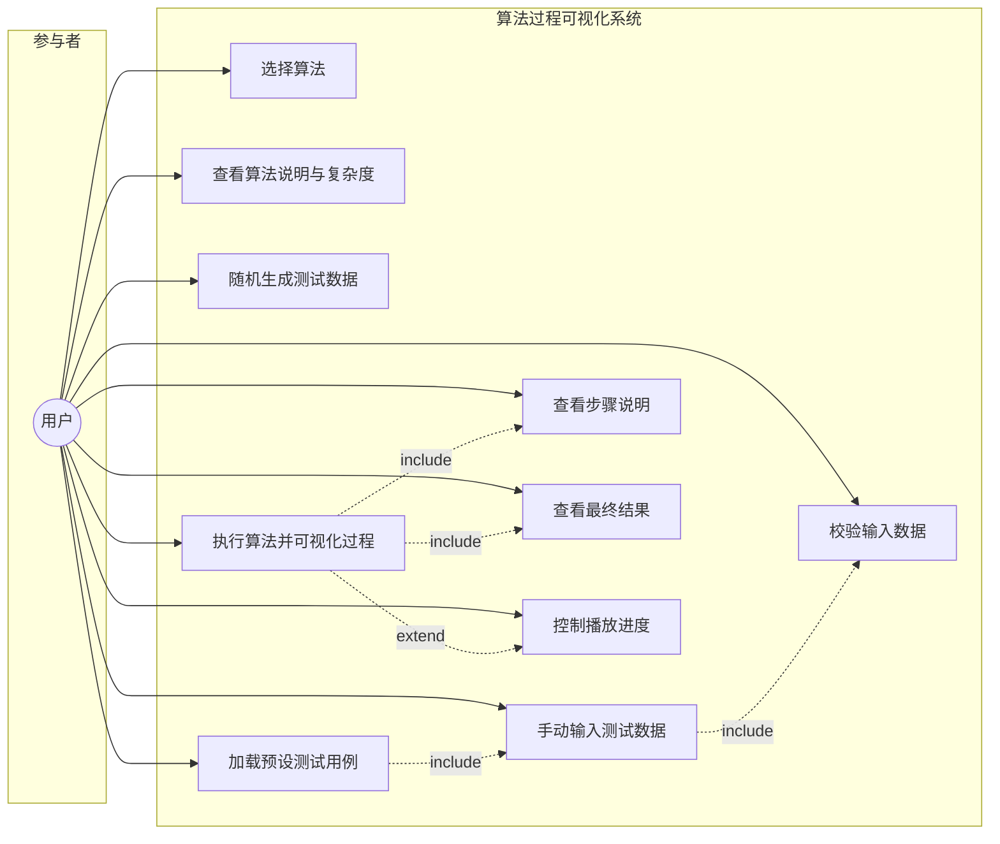
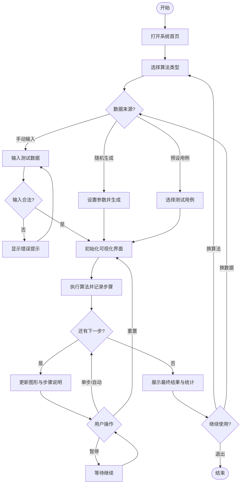
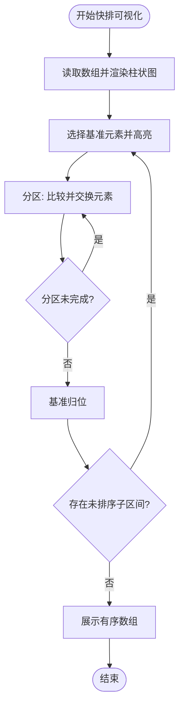
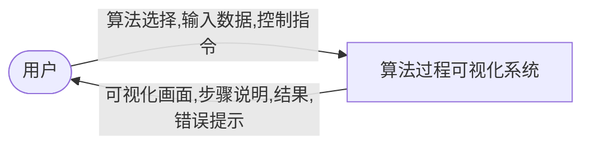
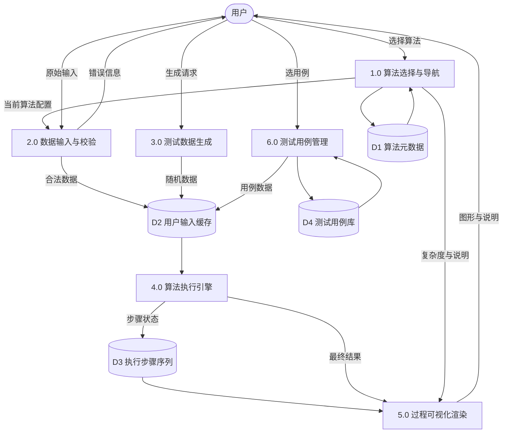
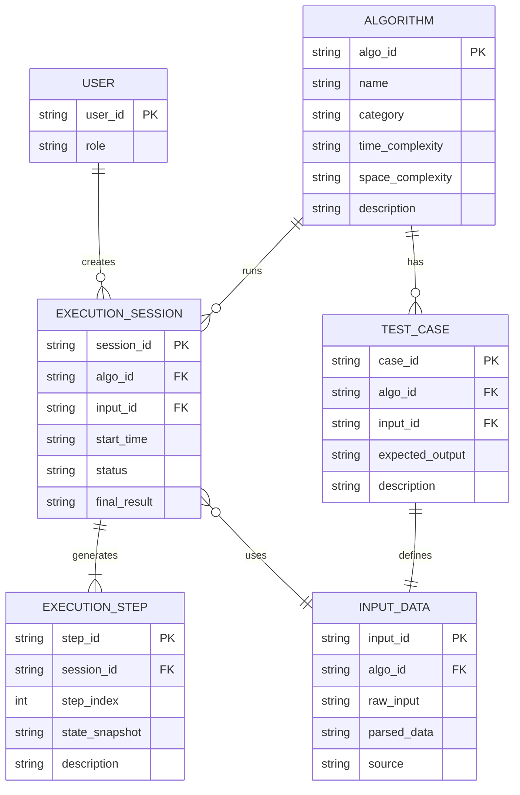

# 算法过程可视化系统 — 需求分析文档

| 项目信息     | 内容                         |
| :----------- | :--------------------------- |
| 项目名称     | 算法过程可视化系统（AVS）    |
| 文档版本     | V1.0                         |
| 编写日期     | 2026年6月19日                |
| 文档状态     | 初稿                         |
| 对应任务书   | 《算法过程可视化系统项目任务书》 |

---

## 目录

1. [问题定义](#1-问题定义)
2. [可行性研究](#2-可行性研究)
3. [需求分析](#3-需求分析)
4. [用例图](#4-用例图)
5. [活动图](#5-活动图)
6. [数据流图](#6-数据流图)
7. [E-R 图](#7-e-r-图)
8. [AI 辅助需求分析说明](#8-ai-辅助需求分析说明)

---

## 1. 问题定义

### 1.1 背景

在数据结构、离散数学和程序设计等课程中，学生通常通过阅读教材、手工推演或运行程序来理解算法。传统方式存在以下问题：

- **过程不可见**：多数程序只输出最终结果，学生难以观察算法执行过程中的中间状态与关键决策。
- **抽象难理解**：图算法、递归与回溯等算法涉及复杂状态变化，纯文字或静态图示难以建立直观认识。
- **实验成本高**：手工构造测试数据、逐步推演耗时且易出错，不利于反复对比与验证。
- **知识割裂**：不同算法的演示工具分散，缺乏统一入口与一致的交互体验。

### 1.2 待解决问题

本系统旨在解决 **“算法执行过程难以被直观观察与理解”** 的核心问题，具体包括：

1. 如何以统一界面展示多种类型算法的执行过程；
2. 如何将算法内部状态变化转化为图形、动画或步骤列表等可视化形式；
3. 如何支持用户灵活输入或生成测试数据，并验证算法正确性；
4. 如何在展示过程的同时提供算法说明、复杂度分析与测试用例支持。

### 1.3 系统目标

开发一个 **算法过程可视化与实验平台**，使用户能够：

- 选择算法并输入或随机生成测试数据；
- 观察算法执行过程中的关键状态变化（而非仅看最终结果）；
- 获取步骤说明、时间/空间复杂度及测试用例运行结果；
- 在统一界面风格下完成多种算法的学习与实验。

### 1.4 目标用户

| 用户角色       | 描述                                           | 主要诉求                                       |
| :------------- | :--------------------------------------------- | :--------------------------------------------- |
| **学生用户**   | 学习数据结构、算法相关课程的本专科学生         | 理解算法原理、观察执行过程、完成课程实验       |
| **教师用户**   | 讲授算法课程的教师                             | 课堂演示、布置实验、展示算法对比               |
| **自学者**     | 自学算法与编程的爱好者                         | 自主练习、验证理解、查阅复杂度与步骤说明       |
| **项目开发者** | 课程设计项目组成员                             | 按规范实现功能、编写文档、完成测试与交付       |

本系统以 **学生用户** 为主要服务对象，教师与自学者为次要服务对象；开发者角色用于保障系统可维护性与可交付性。

### 1.5 项目范围

**范围内：**

- 至少 3 类算法的过程可视化（含 1 个中等及以上难度算法）；
- 统一入口与统一界面风格；
- 手动输入与随机生成测试数据；
- 过程展示、结果展示、步骤说明、复杂度说明；
- 每算法至少 2 条测试用例（项目总计不少于 6 条）；
- README 及配套文档。

**范围外（本期不强制实现，可作为扩展）：**

- 用户账号与权限管理；
- 在线协作与云端数据同步；
- 第 4 类算法、算法对比、执行日志导出等扩展功能（见 3.3 节）。

### 1.6 算法选型（本期）

结合任务书推荐组合与难度要求，本期选定以下三类算法：

| 序号 | 算法类型 | 选定算法     | 难度   | 可视化要点                           |
| :--- | :------- | :----------- | :----- | :----------------------------------- |
| 1    | 排序     | 快速排序     | 低-中  | 分区、基准元素、递归子区间           |
| 2    | 图算法   | Dijkstra 最短路径 | 中 | 距离表更新、已访问集合、路径松弛     |
| 3    | 递归     | 汉诺塔       | 中-高  | 盘子移动、递归调用栈、源/辅助/目标柱   |

---

## 2. 可行性研究

### 2.1 技术可行性

**拟采用技术路线：Web 前端方案**

| 层次       | 技术选型              | 说明                                           |
| :--------- | :-------------------- | :--------------------------------------------- |
| 表现层     | HTML5、CSS3、JavaScript | 构建统一界面与交互逻辑                       |
| 可视化     | Canvas / SVG          | 绘制数组、图结构、汉诺塔等动态图形             |
| 构建工具   | Vite（可选）          | 本地开发与打包，提升开发效率                   |
| 运行环境   | 现代浏览器            | Chrome、Edge、Firefox 等，无需额外安装客户端   |

**可行性结论：**

- 三类算法均可在浏览器端以 JavaScript 实现，并记录每一步状态用于回放展示；
- Canvas/SVG 可满足排序柱状图、图节点边、汉诺塔塔柱等可视化需求；
- 小组成员具备 HTML/CSS/JavaScript 基础，学习成本可控；
- 不依赖后端服务器即可满足课程设计基本功能，部署简单（本地打开或静态托管均可）。

### 2.2 经济可行性

- **开发成本**：以开源技术与免费开发工具为主，无商业授权费用；
- **硬件成本**：普通 PC 即可满足开发与运行；
- **维护成本**：静态 Web 应用结构简单，后期维护工作量较小。

**结论：** 经济可行，适合课程设计场景。

### 2.3 操作可行性

- 界面采用 **算法选择 → 数据输入 → 执行控制 → 过程观察** 的统一流程，符合用户直觉；
- 提供预设测试用例与输入格式说明，降低使用门槛；
- 浏览器访问，无需复杂安装步骤。

**结论：** 操作可行，目标用户可快速上手。

### 2.4 法律与合规可行性

- 使用开源框架与自研算法实现代码，不涉及侵权；
- 不收集个人敏感信息（基本版无用户登录）；
- 遵守学校课程设计与学术诚信要求，如实标注 AI 辅助开发内容。

**结论：** 法律与合规风险低。

### 2.5 进度可行性

| 阶段     | 时间                     | 主要工作                         |
| :------- | :----------------------- | :------------------------------- |
| 需求分析 | 2026-06-17 ~ 2026-06-19  | 本文档及用例、流程建模           |
| 系统设计 | 2026-06-17 ~ 2026-06-21  | 架构、模块、接口、界面设计       |
| 实现测试 | 2026-06-17 ~ 2026-07-01  | 编码、联调、测试、文档整理       |

三类算法中，快速排序实现难度较低，可优先完成；Dijkstra 与汉诺塔分阶段推进。预留测试与文档时间，进度可行。

### 2.6 可行性研究总结

综合技术、经济、操作、合规与进度分析，**本项目具备实施条件**，建议采用 Web 前端方案推进。

---

## 3. 需求分析

### 3.1 功能需求

#### 3.1.1 功能需求总览

| 编号   | 功能模块         | 功能描述                                           | 优先级 |
| :----- | :--------------- | :------------------------------------------------- | :----- |
| FR-001 | 算法选择与导航   | 提供统一入口，展示算法列表及简介，支持切换算法     | 高     |
| FR-002 | 测试数据输入     | 支持手动输入符合格式要求的测试数据                 | 高     |
| FR-003 | 随机数据生成     | 支持一键生成符合约束的随机测试数据                 | 高     |
| FR-004 | 算法过程可视化   | 以动画/步骤列表展示关键状态变化，不仅显示最终结果  | 高     |
| FR-005 | 步骤文字说明     | 每步或关键步提供可读的操作说明                     | 高     |
| FR-006 | 结果展示         | 展示算法最终输出及与输入的对应关系                 | 高     |
| FR-007 | 复杂度说明       | 展示时间复杂度与空间复杂度及简要解释               | 高     |
| FR-008 | 测试用例管理     | 内置预设用例，支持一键加载运行                     | 高     |
| FR-009 | 输入校验与提示   | 对非法格式、越界数据进行提示                       | 中     |
| FR-010 | 播放控制         | 单步执行、自动播放、暂停、重置（扩展）             | 中     |
| FR-011 | 步骤回退         | 支持返回上一步观察状态（扩展）                     | 低     |
| FR-012 | 执行日志导出     | 导出步骤记录为文本文件（扩展）                     | 低     |

#### 3.1.2 各算法专项功能需求

**（1）快速排序（FR-SORT）**

| 编号        | 需求描述 |
| :---------- | :------- |
| FR-SORT-001 | 用户可输入整数数组（逗号或空格分隔），或随机生成指定长度数组 |
| FR-SORT-002 | 可视化展示当前分区范围、基准元素位置、元素比较与交换 |
| FR-SORT-003 | 步骤说明包含：选择基准、分区比较、交换、递归子区间等 |
| FR-SORT-004 | 展示排序完成后的有序数组及比较/交换次数（可选统计） |
| FR-SORT-005 | 显示时间复杂度 O(n log n)（平均）、O(n²)（最坏）；空间复杂度 O(log n) |

**（2）Dijkstra 最短路径（FR-GRAPH）**

| 编号         | 需求描述 |
| :----------- | :------- |
| FR-GRAPH-001 | 用户可输入带权无向/有向图（节点数、边列表、源点、目标点）或加载预设图 |
| FR-GRAPH-002 | 可视化展示图结构、当前访问节点、距离表更新、最短路径树生长过程 |
| FR-GRAPH-003 | 步骤说明包含：选取最小距离节点、松弛相邻边、更新前驱等 |
| FR-GRAPH-004 | 展示源点到各节点最短距离及到目标点的路径 |
| FR-GRAPH-005 | 显示时间复杂度 O(V²) 或 O(E log V)（依实现而定）；空间复杂度 O(V) |

**（3）汉诺塔（FR-HANOI）**

| 编号         | 需求描述 |
| :----------- | :------- |
| FR-HANOI-001 | 用户可输入盘子数量 n（如 3~8），或选择预设用例 |
| FR-HANOI-002 | 可视化展示三根柱及盘子移动动画，标注当前移动规则 |
| FR-HANOI-003 | 步骤说明包含：递归分解、移动最大盘、子问题规模等 |
| FR-HANOI-004 | 展示总移动步数（2ⁿ − 1）及完整移动序列 |
| FR-HANOI-005 | 显示时间复杂度 O(2ⁿ)；空间复杂度 O(n)（递归栈） |

#### 3.1.3 测试用例需求

每个算法至少提供 **2 条** 内置测试用例，项目总计不少于 **6 条**。

| 算法       | 用例编号 | 用例描述               | 输入示例                              | 预期要点                     |
| :--------- | :------- | :--------------------- | :------------------------------------ | :--------------------------- |
| 快速排序   | TC-S-01  | 普通无序数组           | `[64, 34, 25, 12, 22, 11, 90]`        | 升序排列正确                 |
| 快速排序   | TC-S-02  | 含重复元素数组         | `[3, 1, 4, 1, 5, 9, 2, 6, 5]`         | 重复元素处理正确             |
| Dijkstra   | TC-G-01  | 小型无向加权图         | 5 节点、7 条边，源点 0，目标点 4      | 最短路径与距离正确           |
| Dijkstra   | TC-G-02  | 不可达目标             | 两连通分量图，源点与目标不连通        | 正确提示不可达或距离为 ∞     |
| 汉诺塔     | TC-H-01  | 3 盘经典用例           | n = 3                                 | 7 步，移动序列符合规则       |
| 汉诺塔     | TC-H-02  | 4 盘用例               | n = 4                                 | 15 步，无非法叠放            |

### 3.2 非功能需求

| 编号    | 类别       | 需求描述                                                     |
| :------ | :--------- | :----------------------------------------------------------- |
| NFR-001 | 易用性     | 主流程（选算法→输入→运行→观察）不超过 4 次主要操作           |
| NFR-002 | 一致性     | 三类算法页面布局、配色、按钮命名、信息区结构保持统一           |
| NFR-003 | 响应性     | 小规模测试数据下，单步切换响应时间 ≤ 500ms（本地环境）       |
| NFR-004 | 正确性     | 内置测试用例 100% 通过；算法输出与标准结果一致                 |
| NFR-005 | 可维护性   | 算法逻辑与可视化渲染分层，便于新增第 4 类算法                |
| NFR-006 | 兼容性     | 支持 Chrome 100+、Edge 100+；分辨率 ≥ 1280×720 下布局正常    |
| NFR-007 | 可读性     | 步骤说明使用中文，术语与教材保持一致                         |
| NFR-008 | 可部署性   | 提供 README，说明依赖安装与启动方式，他人可复现运行            |
| NFR-009 | 文档性     | 需求、设计、实现、测试文档内容一致、可追溯                     |

### 3.3 扩展功能需求（可选）

完成基本功能后可择机实现：

1. 第 4 类算法（如迷宫求解回溯）；
2. 单步/自动播放/暂停/重置；
3. 上一步回退；
4. 执行日志导出；
5. 排序算法对比（如冒泡 vs 快排）；
6. 保存用户自定义测试数据（LocalStorage）；
7. 输入范围检查与友好错误提示；
8. 讲解模式（关键步骤附加教学说明）。

### 3.4 数据需求

| 数据项           | 说明                                   | 来源           |
| :--------------- | :------------------------------------- | :------------- |
| 算法元数据       | 名称、类型、简介、复杂度               | 系统内置       |
| 用户输入数据     | 数组、图、盘子数等                     | 用户输入/随机生成 |
| 执行步骤序列     | 每步状态快照、操作描述、高亮元素       | 算法引擎生成   |
| 测试用例库       | 输入、期望输出、说明                   | 系统内置       |
| 运行配置         | 动画速度、是否自动播放等（扩展）       | 用户设置       |

### 3.5 接口需求（用户界面）

- **首页/导航区**：系统标题、算法卡片或菜单；
- **算法工作区**：输入区、控制按钮、可视化画布、步骤列表；
- **信息区**：算法说明、复杂度、当前步骤描述、最终结果；
- **测试用例区**：用例列表及“加载运行”操作。

### 3.6 约束与假设

**约束：**

- 须满足任务书 2.2 节全部基本功能要求；
- 开发周期截至 2026 年 7 月 1 日；
- 文档须体现 AI 辅助开发说明。

**假设：**

- 用户在现代浏览器环境下使用；
- 测试数据规模适中（如排序 n ≤ 20，图节点 ≤ 15，汉诺塔 n ≤ 8），以保证动画可观察；
- 本期不要求多用户并发与后端持久化。

### 3.7 验收标准

| 编号 | 验收项                                           | 通过标准                         |
| :--- | :----------------------------------------------- | :------------------------------- |
| AC-01 | 实现 3 类算法可视化                             | 快排、Dijkstra、汉诺塔均可运行   |
| AC-02 | 含中等及以上难度算法                            | Dijkstra 或汉诺塔达到中等及以上  |
| AC-03 | 统一入口与界面风格                              | 视觉与交互流程一致               |
| AC-04 | 手动输入与随机生成                              | 三类算法均支持                   |
| AC-05 | 展示执行过程                                    | 有分步/动画，非仅最终结果        |
| AC-06 | 结果、步骤、复杂度                                | 界面均可见                       |
| AC-07 | 测试用例                                        | ≥ 6 条，每算法 ≥ 2 条            |
| AC-08 | README                                          | 含运行方式、输入格式、测试说明   |

---

## 4. 用例图

系统主要参与者为 **学生用户**；**教师用户** 与用例高度重合，此处合并为主要参与者“用户”。开发者通过维护系统间接参与，不单独建模业务用例。

**用例说明摘要：**

| 用例编号 | 用例名称           | 简述 |
| :------- | :----------------- | :--- |
| UC-01    | 选择算法           | 用户从统一入口进入某一算法可视化页面 |
| UC-02    | 查看算法说明与复杂度 | 阅读算法原理、时间/空间复杂度 |
| UC-03    | 手动输入测试数据   | 按格式输入数组、图或参数 |
| UC-04    | 随机生成测试数据   | 系统生成合法随机输入 |
| UC-05    | 加载预设测试用例   | 一键填入内置用例数据 |
| UC-06    | 执行算法并可视化过程 | 驱动算法并逐步展示状态 |
| UC-07    | 查看步骤说明       | 阅读当前步骤文字描述 |
| UC-08    | 查看最终结果       | 查看算法输出 |
| UC-09    | 控制播放进度       | 单步、播放、暂停、重置（扩展） |
| UC-10    | 校验输入数据       | 格式与范围检查并提示 |

---

## 5. 活动图

### 5.1 系统总体业务流程

### 5.2 快速排序执行活动（子流程）

---

## 6. 数据流图

### 6.1 顶层数据流图（Context Diagram）

### 6.2 一层数据流图（Level-1 DFD）

**数据存储说明：**

| 存储 | 名称           | 主要内容                           |
| :--- | :------------- | :--------------------------------- |
| D1   | 算法元数据     | 算法 ID、名称、类型、复杂度、说明  |
| D2   | 用户输入缓存   | 当前算法的输入参数与解析结果       |
| D3   | 执行步骤序列   | 步骤序号、状态快照、操作描述       |
| D4   | 测试用例库     | 用例 ID、输入、期望输出、描述      |

---

## 7. E-R 图

系统以浏览器本地运行为主，不涉及复杂持久化；E-R 模型描述 **逻辑数据实体及其关系**，用于指导模块设计与测试用例组织。用户实体在基本版中不落库，仅作概念建模。

**实体属性说明：**

| 实体 | 属性 | 说明 |
| :--- | :--- | :--- |
| USER | user_id | 用户标识（可选，扩展功能用） |
| USER | role | 角色：学生 / 教师 |
| ALGORITHM | category | 算法类型：排序 / 图 / 递归 |
| INPUT_DATA | parsed_data | 解析后的结构化输入（JSON 字符串） |
| INPUT_DATA | source | 数据来源：manual / random / testcase |
| EXECUTION_SESSION | status | 状态：running / completed / error |
| EXECUTION_STEP | state_snapshot | 该步算法状态快照（JSON 字符串） |

**实体关系说明：**

- 一个 **算法（ALGORITHM）** 对应多条 **测试用例（TEST_CASE）**；
- 一次 **执行会话（EXECUTION_SESSION）** 使用一份 **输入数据（INPUT_DATA）**，并产生多条 **执行步骤（EXECUTION_STEP）**；
- 基本功能阶段，D3 步骤序列与会话信息可仅存于内存；扩展功能可将 EXECUTION_SESSION 持久化至 LocalStorage。

---

## 8. AI 辅助需求分析说明

### 8.1 使用的 AI 工具

| 工具名称        | 用途                         | 使用阶段     |
| :-------------- | :--------------------------- | :----------- |
| Cursor（AI 助手） | 需求梳理、文档起草、图表语法 | 需求分析阶段 |

### 8.2 AI 参与的具体环节

1. **问题定义与范围界定**  
   - 向 AI 提供《项目任务书》全文，请求归纳背景、目标用户与项目范围；  
   - AI 输出初稿后，小组对照任务书 2.2、2.3 节逐项核对，确认三类算法选型与难度要求。

2. **功能需求条目化**  
   - 使用 AI 将任务书基本功能拆解为 FR/NFR 编号列表；  
   - 人工补充各算法输入格式、可视化要点及测试用例表格。

3. **UML 与 DFD 图表起草**  
   - 由 AI 生成 Mermaid 格式的用例图、活动图、数据流图、E-R 图初稿；  
   - 组员根据实际交互流程调整用例 include/extend 关系及数据存储划分。

4. **非功能需求与验收标准**  
   - AI 建议易用性、性能、兼容性等指标；  
   - 小组结合课程设计周期与团队技术栈，将性能指标限定为“本地小规模数据可流畅演示”。

### 8.3 人工修改与验证记录

| 序号 | AI 原始建议                         | 人工处理                               | 理由 |
| :--- | :---------------------------------- | :------------------------------------- | :--- |
| 1    | 建议实现 5 类以上算法               | **否定**，保留 3 类基本算法            | 符合任务书最低要求，保证按期交付 |
| 2    | 建议引入 Node.js 后端与数据库       | **修改**为纯前端 + 内存/LocalStorage   | 降低部署复杂度，满足可视化演示目标 |
| 3    | Dijkstra 仅支持有向图               | **修改**为支持有向/无向图（可配置）    | 适配教材常见例题与测试用例 |
| 4    | 用例图单独列出“开发者维护系统”用例  | **删除**该用例，开发者不纳入业务用例图 | 聚焦最终用户场景，符合课程建模规范 |
| 5    | 性能要求“单步响应 ≤ 100ms”          | **修改为 ≤ 500ms**                     | 兼顾汉诺塔高步数场景下的渲染开销 |
| 6    | 测试用例仅描述不写具体输入            | **补充** 6 条用例的具体输入与预期要点  | 满足任务书 2.2 第 7 条及验收可追溯 |

### 8.4 需求分析阶段 AI 使用小结

AI 工具提高了需求文档结构与图表模板的起草效率，尤其在 Mermaid 语法与需求编号体系方面减少了重复劳动。但是**最终需求以项目任务书为准**，所有功能范围、算法数量、测试用例数量与交付要求均经小组人工评审确认。
